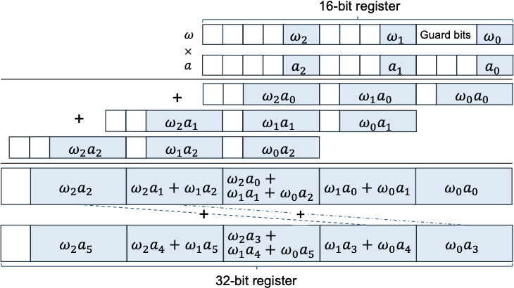
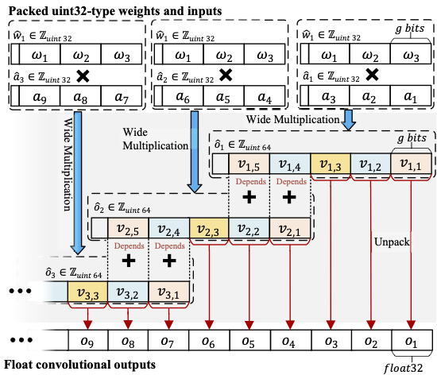
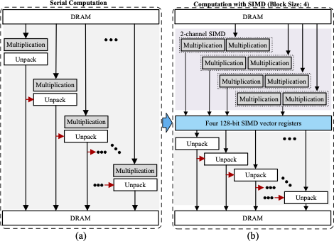
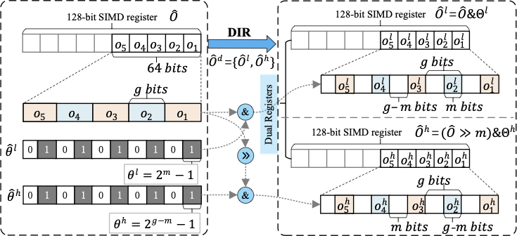

# HIPACK

**HIPACK** is an efficient sub-8-bit direct convolution acceleration library to maximize the performance of quantized NN execution on Arm processors.

---

## Design Principles

HiPACK follows the theoretical approach of adopting multiplication for low-bitwidth convolution and develops a series of novel approaches to fill the efficiency gap of low-bitwidth convolution on wimpy processors with SIMD optimizations and bitwise management. 
HiPack is built upon the following principles:
1. **Multiplication-based Convolution**: Adopts long-bitwidth multiplication for low-bitwidth convolution. 



2. **Data Dependency Elimination**: Identifies and handles data dependencies in the process of adopting large-bitwidth multiplication for low-bitwidht convolution operations.



3. **SIMD Optimization**: Utilizes SIMD instructions to maximize data reuse with operation decoupling and reordering to improve data parallelism.



4. **Bitwise Management**: Develops **optimal segmentation bitwidth identification** mechanism and **dual interleaved register** mechanism to improve the efficiency of low-bitwidth convolution on wimpy processors with bitwise management. 



The synergistic combination of the above methods is thoroughly evaluated with various CNN models on ARM processors. Experimental results demonstrate over $3.2\times$ performance improvements compared to existing approaches, enabling efficient execution of low-bitwidth DNNs on resource-constrained ARM devices.

---

## Features

1. **Dynamic Bitwidth Support**: Adapts to quantized computations with bitwidths lower than 8-bit.
2. **High Performance**: Significant performance improvements, achieving a minimum of 3.2x speedup.
3. **PyTorch Integration**: Provides PyTorch operator interfaces in [torch_func](./torch_func/README.md), making it easy to integrate into existing deep learning workflows.
4. **Support for Various Convolution Shapes**:
   - **DirectConv (nx3)**: Native support for `nx3` convolution shapes.
   - **DirectConv (nxn)**: Extended implementation for arbitrary `nxn` shapes by tiling them into multiple `nx3` convolutions.

---
# Benchmarking Results

## Implementation Instructions

The native support of `nx3` kernel is implemented with C++ and located in [src](./src) folder. The other convolution kernel sizes are implemented by tiling the convolution into multiple `nx3` convolutions through pytorch function calls (detailed in [torch_func](./torch_func/README.md) folder).

## Environmental Setups

```shell
# C++17
# g++ 10.2.1 
# PyTorch >= 2.2.2 (With PyTorch C++ extension)
# OpenMP
# Clone this repository to your local raspberry pi 4B+ platform
```

## `nx3` kernel implementation (C++ backend)

### Customizable parameters
- **N**: Input batch size. (Supported values: 1, 2, 4, 8)
- **Ci**: Number of input channels. (Supported values: 32, 64, 128, 256)
- **H**: Height of input feature map. (Supported values: 8, 16, 32)
- **W**: Width of input feature map. (Currently only support numbers divisible by 12, if not, will be padded with zeros to the nearest number divisible by 12, e.g., 32 will be padded to 36. Recommented values: 12, 24, 36)
- **Co**: Number of output channels. (Supported values: 32, 64, 128, 256)
- **WA_bits**: Bitwidth of weights and activations. (Supported values: 1, 2, 3, 4, 5, 6. Note: values greater than 4 may have the risk of overflow.)
- **verbose**: Whether to print verbose information. (Supported values: 0, 1)
- **debug**: Whether to verify the correctness of the computation. (Supported values: 0, 1)

Based on these parameters, the tensor dimensions for computation are represented as:
- Input shape: [N, Ci, H, W]
- Weight shape: [Co, Ci, 3, 3]

Use the following command to run the fast expetiments on a Raspberry Pi 4B+ platform.
```shell
$ cd src
# The make commond is inserted into the shell script
$ bash run_bench.sh
```
You can get the following output (configuration with performance) if no compilation and execution errors.
```
config: N1 Ci2 H2 W2 Co2 W3A3 debug1 verbose0
	[W3A3] input[1,2,2,12] * weight[2,2,3,3]: Test pass
	[W3A3] input[1,2,2,12] * weight[2,2,3,3]: Elapsed time: 0.000168 seconds Performance: 0.023943 GFLOPS.
config: N1 Ci2 H2 W2 Co4 W3A3 debug1 verbose0
	[W3A3] input[1,2,2,12] * weight[4,2,3,3]: Test pass
	[W3A3] input[1,2,2,12] * weight[4,2,3,3]: Elapsed time: 0.001268 seconds Performance: 0.006360 GFLOPS.
...
...
config: W3A3, save to: logs/test_hipack_perf_W3A3.log
        [W3A3] input[16,3,224,228] * weight[32,3,3,3]: Elapsed time: 0.224631 seconds Performance: 6.397795 GFLOPS.
        [W3A3] input[16,32,112,120] * weight[64,32,3,3]: Elapsed time: 0.248804 seconds Performance: 32.970821 GFLOPS.
...
...
        [W3A3] input[16,512,7,12] * weight[1024,512,3,3]: Elapsed time: 0.221781 seconds Performance: 85.784536 GFLOPS.
        [W3A3] input[16,1024,7,12] * weight[1024,1024,3,3]: Elapsed time: 0.446465 seconds Performance: 85.226671 GFLOPS.
```

## `nxn` Kernel implementation (PyTorch implementation)

### PyTorch Integration

Navigate to the torch_func folder.

```shell
cd torch_func/
```

#### 1. Compile the DirectConv Operator

```bash
# compile commands are scripted in compile.sh
bash compile.sh
```
Once compiled, the `direct_conv` operator is ready to use for convolutions.


#### 2. Using the DirectConv Operator

Refer to the file `usage_of_directconv.py` for an example of how to use the `direct_conv` operator for efficient convolutions.
The following is a simple example.

```python
from direct_conv2d import direct_conv2d

N, Ci, H, W, Co, W_bits,A_bits =16,256,32,36,256,3,3
flops = 2*N*Ci*Co*H*W*3*3
inp = torch.randint(0, 2**A_bits -1, (N, Ci, H, W)).int()
weight = torch.randint(0, 2**W_bits -1, (Co, Ci, 3, 3)).int()
output = direct_conv2d(inp,weight,W_bits, A_bits,1,1,0,0)
```

#### 3. Extending to nxn Convolution Shapes

`nxn` shape support is implementated by tiling `nxn` convolutions into multiple `nx3` convolutions. For example:
- A **5x5 convolution** can be tiled into **2 5x3 convolutions**.
- A **9x9 convolution** can be tiled into **3 9x3 convolutions**.

Refer to the file `extend_conv2d.py` for details on using the extended convolution operator.


## Full Model Evaluations

We have conducted comprehensive model evaluations, including VGG16, ResNet18, and ResNet34, as detailed in our manuscript. These evaluations can be found in the file [torch_func/full_model_eval.py](./torch_func/full_model_eval.py).
In these models, only 3x3 convolutions have been replaced with `direct_conv2d`, which is the PyTorch integration of HIPACK as previously mentioned.

You can use the following command to run the fast expetiments on a Raspberry Pi 4B+ platform (You need complie the PyTorch intergration first).

```shell
cd torch_func
python full_model_eval.py
```

Then you can get following outputs:
```shell
Evaluate latency on VGG16 with batchsize of 16:
Float time: 55.3923 s
Qint8 time: 14.0694 s
HIPACK time: 11.6774 s
Evaluate latency on ResNet18 with batchsize of 16:
Float time: 6.3254 s
Qint8 time: 3.2957 s
HIPACK time: 2.9776 s
Evaluate latency on ResNet34 with batchsize of 16:
Float time: 10.2774 s
Qint8 time: 6.0597 s
DC time: 5.3619 s
```